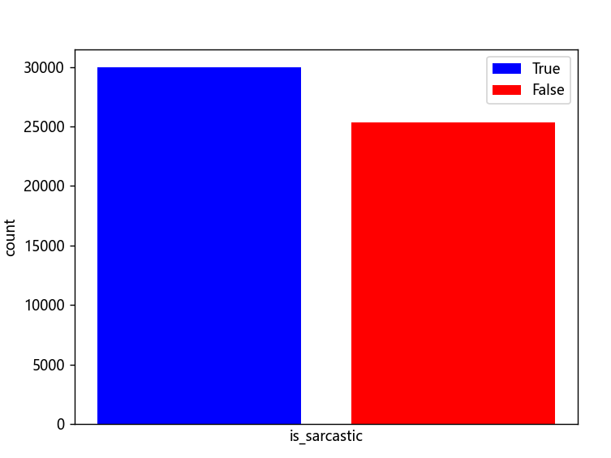
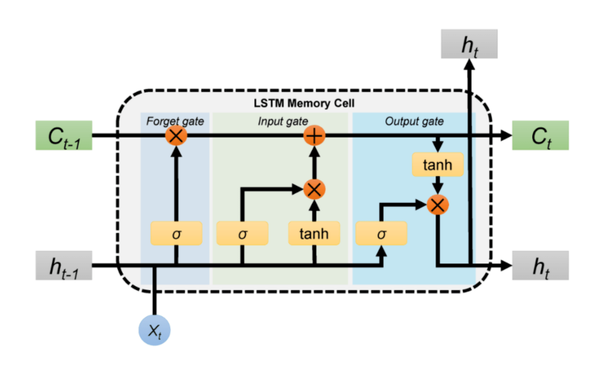
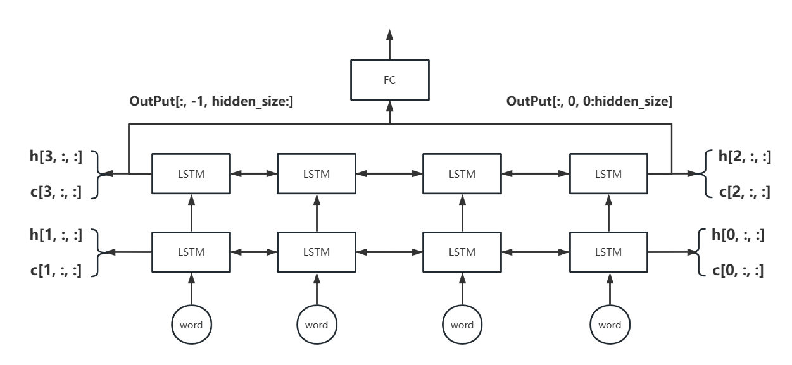
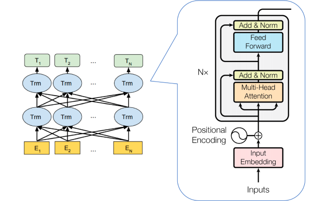

## 前言

这篇笔记是我在完成自然语言处理课程设计时所记录下的，其中不乏有许多错误之处，如有问题的地方或者不理解的地方，可以及时联系我。另外我会非常乐意与大家交流分享一些技术上的知识，[此篇博客](http://echoself.com/index.php/2023/05/24/82/)完整代码我将会放在我的[Github](https://github.com/Heappp/LSTM-BERT/edit/main)上，有需要请自取哈。**公式不能正常显示请刷新一次！！**

## 包括内容

自然语言处理（Natural Language Processing， 简称 NLP）是涉及的领域方向有文本分类、机器翻译、信息抽取、聊天机器人、自动摘要、情感 分析、语音识别。自然语言处理技术可以有效地处理信息，提高生活地质量。本文主要针对文本分类任务，实现对讽刺新闻标题的分类。其内容主要包括如下：

- 讽刺新闻标题数据集介绍
- 单词嵌入介绍
- LSTM介绍及其运行结果
- BERT介绍及其运行结果
- 两种方法的对比与总结

## 数据集介绍

Kaggle 是一个数据科学竞赛平台，也是一个社 交网络，在该平台上你可以找到很多有趣的数据问 题，可以和世界各地的数据科学家一起竞赛解决数 据科学问题。本文使用的数据集来自于kaggle平台的[讽刺新闻标题数据集](https://www.kaggle.com/datasets/rmisra/news-headlines-dataset-for-sarcasm-detection)，该数据集有两个文件，可以用以下代码读取，代码如下。

```python
df1 = pd.read_json('archive/Sarcasm_Headlines_Dataset.json', lines=True)
df2 = pd.read_json('archive/Sarcasm_Headlines_Dataset_v2.json', lines=True)
df = pd.concat([df1, df2], axis=0) # 拼接
print(df.info())

'''
<class 'pandas.core.frame.DataFrame'>
Int64Index: 55328 entries, 0 to 28618
Data columns (total 3 columns):
 #   Column        Non-Null Count  Dtype 
---  ------        --------------  ----- 
 0   article_link  55328 non-null  object
 1   headline      55328 non-null  object
 2   is_sarcastic  55328 non-null  int64 
dtypes: int64(1), object(2)
memory usage: 1.7+ MB
None
'''
```

由此看出该数据集主要由headline和is_sarcastic分别是新闻标题和标签，共55328个新闻标题数据。在此基础上，我将其分为训练集和测试集，比例分别为 8:2，两者没有交集，互不干扰。

另外在此数据集当中分为了是讽刺新闻标题和不是讽刺新闻标题两个不同的标签，这是一个文本分类问题。下图是这两种标签数据量大小对比图，可以看出该数据集几乎是平衡的，并不需要对数据集做数据不平衡的相关处理。

```python
grouper = dict(map(lambda x: (x[0], len(x[1])), df.groupby('is_sarcastic').groups.items()))
plt.bar(x=0, height=grouper[0], color='blue', label='True')
plt.bar(x=1, height=grouper[1], color='red', label='False')
plt.legend()
plt.tick_params(axis='x', which='both', bottom=False, top=False, labelbottom=False)
plt.xlabel('is_sarcastic')
plt.ylabel('count')
plt.show()
```

<center>

</center>

## 单词嵌入

单词嵌入是一种将自然语言单词映射为实数向量的技术。通过将单词编码为低维稠密向量，单词嵌入可以有效地捕获单词之间的语义关系和上下文信息，从而用于各种自然语言处理任务。为什么需要做单词嵌入？

我们知道在单词转化为向量的过程当中，直接用onehot这种稀疏向量表示会导致维度过大的问题，而单词嵌入就是将单词编码用指定维度的稠密向量表示，这是单词嵌入的本意。而word2vec其实就是一种没有激活函数的神经网络（线性）映射到这种稠密向量，虽说只需要映射即可，但其中神经网络在训练的过程当中还可以学习到更多的一些东西。

在这个训练当中我们可以用大量的语料数据集，学习其中的词的距离关系（可以简单理解为语料数据集两个词出现一起的频率越大，距离就越近）。也就是说单词嵌入不仅仅要映射到这种稠密向量的方式，还需要学习到这种特殊的语料距离关系。所以word2vec有两种不同的训练策略：

- **CBOW**（Continuous Bag of Words）即上下文预测中心词：一般选取选取奇数的滑动窗口，两边的单词作为输入，中间的单词作为标签。（图左）
- **Skip-Gram**即中心词预测上下文：一般选取选取奇数的滑动窗口，中间的单词作为输入，两边的单词作为标签。这样一个窗口分为了几个训练数据。（图右）

<table><tr>
<td></td>
<td></td>
</tr></table>

如上图，x是我们的onehot向量，维度是V，Hidden Layer是我们神经网络映射到的稠密向量，维度是N，其中$W_{V \times N}$是我们学习到的线性映射。最后再映射到维度为V的Output Layer与标签做交叉熵损失做分类任务。当维度很大时交叉熵的计算是很慢的，所以word2vec将多分类任务分为了多个二分类任务，详细信息这里不过多介绍了。

- 降维和去冗余。单词嵌入通过将单词映射到低维向量空间中，将单词表示的维度降低到了一个较小的范围。

- 模型通用性。单词嵌入可以用于各种NLP任务中，且可以在不同的语料库和模型之间共享，从而提高了模型的效率和泛化能力，同时也避免了在每个新任务中重新训练单词嵌入模型的麻烦。

- 提高表达能力。单词嵌入可以发现单词之间的隐藏关系，并将其表示为向量空间中的距离和方向。

## LSTM

长短期记忆网络是一种常用于序列数据处理的深度学习模型。它是循环神经网络（RNN）的一种变体，用于解决传统RNN中的梯度消失和梯度爆炸等问题。其LSTM神经网络的内部结构如下图所示，通过这样的设计，LSTM能够学习和保留长期依赖性，能够对序列中的关键信息进行有效的编码和提取。

#### LSTM单元结构

<center>

</center>

其中Forget gate为遗忘门，input gate为记忆门，Output为输出门。乘号为点乘操作，加号为点加操作。其中sigmod用来学习记忆和遗忘的权重，Tanh用来进行映射关系。$C_{t-1}$为当前时间步的记忆内容，$h_{t-1}$为上一时间步的隐藏层输出。

- **遗忘门：**通过sigmoid函数学习遗忘权重，之后与$C_{t-1}$点乘得到遗忘后的记忆。
- **记忆门：**分别通过sigmoid函数和tanh学习记忆权重和学习记忆内容，两者做点乘就是在此时间步学习的内容。最后与遗忘后的记忆点加就是更新后的记忆$C_{t}$。
- **输出门：**更新后的记忆通过tanh函数映射变为当前的知识，而$h_{t-1}$通过sigmoid函数学习输出权重，两者相乘为当前时间隐层输出。

#### 双向双层LSTM

双向LSTM不仅可以提取正向的语义信息，还可以提取反向的语义信息，最后经过拼接后一起输入全连接层得到分类结果，这样可以最大层度上提高分类的准确率。而LSTM设计为两层可以有更丰富地特征表达和更好地建模能力。一个简单的双向两层LSTM如下图所示。

<center>

</center>

- **Output：**[batch_size, seq_size, emb_dim * bidirectional]

- **h、c：**[num_layers * bidirectional, batch_size, emb_dim]

如上图，Output的输出实际上是两个方向上的输出在emb_dim维度上进行拼接的结果。所以双向LSTM最后一层两头的输出分别为OutPut[:, -1, hidden_size:]和OutPut[:, 0, 0:hidden_size]，这两者等效于h[-1, :, :]和h[-2, :, :]。

#### 代码

首先我们需要对讽刺新闻标题数据进行编码，由于每条新闻标题的长度是不定的，为了能够进行批训练，需要对数据进行打包。在Pytorch中封装Dataset，由于涉及到每批的数据要求根据原长度降序排列，所以其中定义了collate_fn函数，用于在封装成DataLoader时变为我们需要的格式即按照原来长度排序且填充为相同长度。

```python
class MyDataSet(Dataset):
    def __init__(self):
        # 读取数据
        df1 = pd.read_json('archive/Sarcasm_Headlines_Dataset.json', lines=True)
        df2 = pd.read_json('archive/Sarcasm_Headlines_Dataset_v2.json', lines=True)
        df = pd.concat([df1, df2], axis=0)

        self.data = df.headline.values
        self.label = df.is_sarcastic.values
        
        # 使用transformers的BertTokenizer进行分词且编码
        self.tokenizer = BertTokenizer.from_pretrained('bert-base-uncased')

    def __getitem__(self, idx):
        text = self.data[idx]
        text = self.tokenizer.encode(text) # 编码

        input_ids = torch.tensor(text, dtype=torch.long) 
        label = torch.tensor(self.label[idx], dtype=torch.long)

        return input_ids, label # 这里并没有对数据进行填充为相同长度，在DataLoader时进行排序和填充

    def __len__(self):
        return len(self.data)

    @staticmethod
    def collate_fn(batch_list):
        # 这里batch_list是一个列表，长度就是batch_size。其中每一个元素就是__getitem__返回的input_ids, label
        batch_list.sort(key=lambda x: len(x[0]), reverse=True) # 根据长度进行降序排序
        length = [len(item[0]) for item in batch_list]

        input_ids = pad_sequence([item[0] for item in batch_list], batch_first=True, padding_value=0) # 填充0为相容长度
        label = torch.tensor([item[1] for item in batch_list])
        length = torch.tensor(length)

        return input_ids, label, length
```

之后我们定义LSTM网络结构，首先是经过一个单词嵌入，之后通过一个LSTM，最后经过全连接层输出为2个神经元进行二分类，代码如下。

```python
class LSTM(torch.nn.Module):
    def __init__(self):
        super(LSTM, self).__init__()
        # BertTokenizer的词表大小为30522，这里我们映射为768维的稠密向量
        self.embedding = nn.Embedding(num_embeddings=30522, embedding_dim=768)
        
        # 这里我们定义双向两层的LSTM，隐藏层大小也为768
        self.lstm = nn.LSTM(input_size=768, hidden_size=768, num_layers=2, batch_first=True, dropout=0.3, bidirectional=True)
        
        # 全连接层, 不用添加nn.Softmax(), 因为torch的交叉熵损失函数中带有softmax
        self.linear = nn.Linear(768 * 2, 2)

    def forward(self, text, length):	# [batch_size, seq_size]
        text = self.embedding(text)		# [batch_size, seq_size, emb_dim]
        pack = pack_padded_sequence(text, length, batch_first=True, enforce_sorted=True) # 打包
        _, (h, _) = self.lstm(pack)		# [4, batch, emb_dim]
        
        # 这里使用h作为双向的输出
        x = torch.concat([h[-1, :, :], h[-2, :, :]], dim=1)		# [batch, emb_dim * 2]
        x = self.linear(x) 										# [batch, 2]
        return x
```

最后我们定义训练部分，这部分和大多数网络训练步骤一样，我们将训练集划分为8:2，使用平滑标签为0.05的交叉熵损失，代码如下。

```python
def Train():
    data = MyDataSet()
    train_data, test_data = random_split(data, [int(len(data) * 0.8), len(data) - int(len(data) * 0.8)])

    net = LSTM().to(device) # 实例化LSTM
    # net.load_state_dict(torch.load('save\LSTM.pt', map_location='cpu')) # 加载训练过程中保存的网络
    loss_function = nn.CrossEntropyLoss(label_smoothing=0.05).to(device) # 交叉熵损失
    optimizer = torch.optim.Adam(net.parameters(), lr=1e-3) # 定义Adam优化器并设置学习率大小
    scheduler = lr_scheduler.StepLR(optimizer, step_size=1, gamma=0.9)
    my_writer = SummaryWriter("tf-logs") # 使用tensorboard进行训练过程可视化

    epoch = 10 # 训练次数
    batch_size = 64 # 批大小

    # 封装train_data和test_data为DataLoader类型方便训练
    # 这里collate_fn使用我们自定义数据集当中的collate_fn，会将__getitem__得到的数据排序填充且封装为Tensor
    train_dataloader = DataLoader(train_data, batch_size=batch_size, shuffle=True, drop_last=False, collate_fn=MyDataSet.collate_fn)
    test_dataloader = DataLoader(test_data, batch_size=batch_size, shuffle=True, drop_last=False, collate_fn=MyDataSet.collate_fn)

    for step in range(epoch):
        # 训练
        net.train() # 修改为训练模式
        train_loss, train_acc = 0, 0
        for input_ids, label, length, in train_dataloader:
            input_ids = input_ids.to(device) 	# [batch_size, seq_size]
            label = label.to(device)			# [batch_size]

            optimizer.zero_grad() # 梯度清除
            y = net.forward(input_ids, length) # 前向传播 [batch_size, 2]
            loss = loss_function(y, label)  # 计算损失
            loss.backward() # 反向传播
            optimizer.step() # 权值更新

            train_loss += loss.item() # 统计损失
            train_acc += torch.sum(torch.eq(torch.max(y, dim=1)[1], label)).item() # 统计准确率
        scheduler.step()

        # 测试
        net.eval() # 修改为测试模式
        test_loss, test_acc = 0, 0
        for input_ids, label, length in test_dataloader:
            input_ids = input_ids.to(device)
            label = label.to(device)

            y = net.forward(input_ids, length) # 前向传播 [batch_size, 2]
            loss = loss_function(y, label) # 计算损失

            test_loss += loss.item() # 统计损失
            test_acc += torch.sum(torch.eq(torch.max(y, dim=1)[1], label)).item() # 统计准确率

        # 统计
        my_writer.add_scalars("Loss", {"train": train_loss / len(train_dataloader), "test": test_loss / len(test_dataloader)}, step)
        my_writer.add_scalars("Acc", {"train": train_acc / len(train_data), "test": test_acc / len(test_data)}, step)
        torch.save(net.state_dict(), "save/LSTM" + str(step) + ".pt")
```

#### 训练结果

启动运行后在Terminal输入 tensorboard --logdir="tf-logs" 就可以实时观察训练过程，输入ctrl+z可以退出。在选取学习率为1e-3和batch_size为64，每次迭代学习率减少为原来的0.9，迭代10次的情况下测试集的准确率能达到0.9714。

<table><tr>
<td></td>
<td></td>
</tr></table>

## BERT

#### BERT模型介绍

BERT是一种预训练的自然语言处理模型，与传统的自然语言处理模型相比，BERT取得了非常显著的效果提升。BERT通过使用Transformer架构，实现双向编码，使得在预训练和微调过程当中都可以考虑上下文信息，BERT模型如下图所示。

<center>

</center>

预训练过程当中是无监督学习，具体分为MLM阶段和NSP阶段。

- 在MLM阶段对于输入序列中的每个单词，以15%的概率用 [MASK] 替换该单词，再以10%的概率随机替换成另一个单词，其余75%的概率保持不变。然后，BERT 模型基于上下文信息来预测这些被掩盖的单词。
- 在NSP阶段随机采样一定量的文本对，其中有50%的文本对是相邻的句子，剩下50%的是随机选取的句子组合。模型需要根据上下文来判断这两个句子是否相邻。

通过以上大量文本数据集的预训练，可以学习到丰富的语义关系和上下文关系，同时还可以拓展到各种不同的自然语言任务下游任务当中，在此基础上进行Fine-tuning微调即可，使得BERT具有很好的泛化性。**对于文本分类任务，BERT模型在文本前插入一个[CLS]符号，并将该符号对应的输出向量作为整篇文本的语义表示，用于文本分类。**

#### 代码

在这里我们使用transformers已经预训练好的bert-base-uncased模型，即我们只需要进行后面的Fine-Tuning即可。其中在单词嵌入为768，具体来说，它由12个 Transformer 编码器组成，每个编码器包含了768个隐藏单元和12个自注意力头。同样我们自定义数据集，代码如下。

```python
class MyDataSet(Dataset):
    def __init__(self):
        df1 = pd.read_json('archive/Sarcasm_Headlines_Dataset.json', lines=True)
        df2 = pd.read_json('archive/Sarcasm_Headlines_Dataset_v2.json', lines=True)
        df = pd.concat([df1, df2], axis=0)

        self.data = df.headline.values
        self.label = df.is_sarcastic.values
        
        # 使用transformers的BertTokenizer进行分词且编码
        self.tokenizer = BertTokenizer.from_pretrained('bert-base-uncased')

    def __getitem__(self, idx):
        text = self.data[idx]
        # 编码并将长度填充为200，其中也返回attention_mask，用于掩盖后面填充的内容。
        text = self.tokenizer.encode_plus(text, add_special_tokens=True, max_length=200, padding='max_length', return_token_type_ids=False)

        input_ids = torch.tensor(text['input_ids'], dtype=torch.long)
        attention_mask = torch.tensor(text['attention_mask'], dtype=torch.long)
        label = torch.tensor(self.label[idx], dtype=torch.long)

        return input_ids, attention_mask, label

    def __len__(self):
        return len(self.data)
```

使用transformers的bert预训练模型，在此基础上bert网络很简单，代码如下。

```python
class BERT(torch.nn.Module):
    def __init__(self):
        super(BERT, self).__init__()
        self.bert = BertModel.from_pretrained('bert-base-uncased')
        self.dropout = nn.Dropout(0.3)
        self.linear = nn.Linear(768, 2)

    def forward(self, text, mask):
        # 这里输出的x为[CLS]
        _, x = self.bert(text, attention_mask=mask, return_dict=False) 	# [batch_size, seq_size]
        x = self.dropout(x) 											# [batch_size, seq_size]
        x = self.linear(x)												# [batch_size, 2]
        return x
```

之后就是训练部分，这部分代码如下。

```python
def Train():
    data = MyDataSet()
    train_data, test_data = random_split(data, [int(len(data) * 0.8), len(data) - int(len(data) * 0.8)])

    net = BERT().to(device)
    # net.load_state_dict(torch.load('save\BERT9.pt', map_location='cpu'))
    loss_function = nn.CrossEntropyLoss(label_smoothing=0.05).to(device)
    optimizer = torch.optim.Adam(net.parameters(), lr=1e-5)
    scheduler = lr_scheduler.StepLR(optimizer, step_size=1, gamma=0.9)
    my_writer = SummaryWriter("tf-logs")

    epoch = 10
    batch_size = 64

    train_dataloader = DataLoader(train_data, batch_size=batch_size, shuffle=True, drop_last=False)
    test_dataloader = DataLoader(test_data, batch_size=batch_size, shuffle=True, drop_last=False)

    for step in range(epoch):
        # 训练
        net.train()
        train_loss, train_acc = 0, 0
        for input_ids, attention_mask, label in train_dataloader:
            input_ids = input_ids.to(device)
            attention_mask = attention_mask.to(device)
            label = label.to(device)

            optimizer.zero_grad()
            y = net.forward(input_ids, attention_mask)
            loss = loss_function(y, label)
            loss.backward()
            optimizer.step()

            train_loss += loss.item()
            train_acc += torch.sum(torch.eq(torch.max(y, dim=1)[1], label)).item()
        scheduler.step()

        # 测试T
        net.eval()
        test_loss, test_acc = 0, 0
        for input_ids, attention_mask, label in test_dataloader:
            input_ids = input_ids.to(device)
            attention_mask = attention_mask.to(device)
            label = label.to(device)

            y = net.forward(input_ids, attention_mask)
            loss = loss_function(y, label)

            test_loss += loss.item()
            test_acc += torch.sum(torch.eq(torch.max(y, dim=1)[1], label)).item()

        # 统计
        my_writer.add_scalars("Loss", {"train": train_loss / len(train_dataloader), "test": test_loss / len(test_dataloader)}, step)
        my_writer.add_scalars("Acc", {"train": train_acc / len(train_data), "test": test_acc / len(test_data)}, step)
        torch.save(net.state_dict(), "save/BERT" + str(step) + ".pt")
```

#### 训练结果

启动运行后在Terminal输入 tensorboard --logdir="tf-logs" 就可以实时观察训练过程，输入ctrl+z可以退出。优化器选择初始学习率为1e-5的Adam优化器，损失函数为0.05平滑标签的交叉熵损失函数。设置batch_size为64，迭代10次，每次迭代学习率减少为原来的0.9，最后得到训练集准确率为0.9978，测试集准确率为0.9840。

<table><tr>
<td></td>
<td></td>
</tr></table>

## 结语

在本文当中，我们分别使用了LSTM和BERT模型，对讽刺新闻标题进行分类，从中可以得出两者都能很好的对该数据集进行有效的分类。其中，BERT能够更好的提取数据集当中的语义信息，训练当中收敛更快，在测试集上的表现更为优秀，拥有很好的泛化能力。

另外该数据集使简单的，仅仅是二分类，且新闻标题是短序列，并不能有效体现出两者之间的差别，没有使用更加复杂的数据集和考虑两个模型之间的鲁棒性是本文没有设计到的地方。不仅如此，在此基础上，可以尝试更多更优秀的预训练模型，并对此进行对比，比较这些模型当中的不同。

自然语言处理的应用不仅仅在文本分类方面，更多的还是在机器翻译、信息抽取、聊天机器人、自动摘要、情感分析、语音识别等方向。自然语言处理技术的发展，对我们的生活产生了深远的影响：改变了我们的沟通方式，提高了我们信息处理效率。自然语言处理技术已经深入到我们的日常生活中，为我们带来了便捷和效率。随着技术的不断发展，自然语言处理技术将会在更多领域发挥作用，推动我们的生活变得更加智能、便捷和高效。
